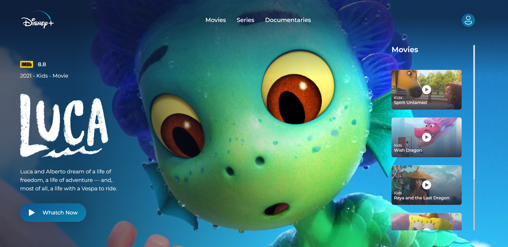

<h1 align="center">
   Redesing Disney+
</h1>

  

Esse projeto foi desenvolvido com o intuito de apresentar um redesing do streaming Disney+

## 🚀 Tecnologias

As seguintes tecnologias foram utilizadas:

- HTML
- CSS

## 🚧 Projeto

Link do projeto no ar: https://iurihenriq.github.io/RedesingDisneyPlus/

## 🎨 Inspiração

Figma: https://www.figma.com/file/AfcZjKNRxDWOSSI0vrnrls/Disney%2B-Streaming-Redesign-(Community)

